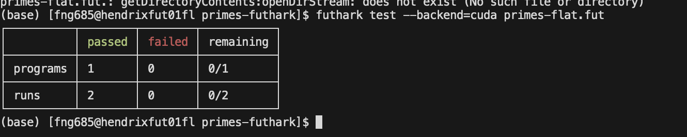

## PMPH Assignment 2

by Wanjing Hu(fng685)

Running Env: hendrixfut01fl(A100-40G)

### Task1 Flat Implementation of Prime-Numbers Computation in Futhark

#### 1.1 Validation status

The implementation passed on both dataset with `futhark test --backend=cuda primes-flat.fut`:



Large dataset (N = 1e7): After generating ref10000000.out with primes-seq.fut as instructed, futhark test will also validate the flat version against that reference (the file already contains the validation stanza).

#### 1.2 Code Explanation

In each iteration with bound len, for every prime `p` in `sqrn_primes` I can form an inner list: `L_p = [2p, 3p, ..., floor(len/p)p]`. Then I concatenate all `L_p` to a single vector not_primes, and scatter zeros at those indices into an all-ones flag vector of length `len+1`. Finally, I filter the indices that remain true to obtain the new `sqrn_primes` for the next (squared) len.

Here:

I have `mult_lens` are exactly the lengths of the irregular inner lists `arr = [2..m]` (multiplier space) per prime p.

`seg_starts` and the `heads+scan` realise the segment descriptor that replaces the irregular structure by indices into a flat array.

`seg_ends` is the inclusive scan of lengths.


```haskell
      -- 
      let seg_ends    = scan (+) 0 mult_lens
      let seg_starts  = map2 (-) seg_ends mult_lens

      -- Build "heads" with the same [S] dimension for indices and values to keep shape certain
      let ones        = map (const 1i64) seg_starts
      let heads       = scatter (replicate flat_size 0i64) seg_starts ones

    -- label each flat position with its segment id
      let seg_ids_inc = scan (+) 0 heads
      let seg_ids     = map (\x -> x - 1i64) seg_ids_inc
```

`j_vals` reconstruct the per-segment multiplier `(2..m)` for each flat element, and multiplying by `p_flat` yields the precise positions I would have produced in the nested `map/concat` comprehension.

```haskell
      let p_flat      = map (\sid -> sq_primes[sid]) seg_ids
      let start_flat  = map (\sid -> seg_starts[sid]) seg_ids
      let idx_flat    = iota flat_size
      let j_vals      = map (+2i64) (map2 (-) idx_flat start_flat)

      let not_primes  = map2 (*) p_flat j_vals
```

### 1.3 Performance on large dataset(1e7)
Here I use the work-depth model to analysis the performance expectation.
Work `W(n)` is the total number of primitive operations performed by the algorithm on an input of size `n`, summing across all parallel branches.

#### 1.3.1 Work analysis
The `primes-seq`, `primes-native` and `primes-flat` all have a work of $W(n)  =  \Theta \big(n \log\ log n\big).$ They directly construct the indices to be eliminated (the sequence of multiples for each base p), set these positions to zero at once; avoid performing division tests on each number individually.

Calculation: 

Work per iteration:
  
  $\sum_{p\in \text{primes} \le \texttt{len}}
  \left(\left\lfloor \frac{\texttt{len}}{p}\right\rfloor - 1\right)
   =  \Theta  \big(\texttt{len} \log\log \texttt{len}\big),$

The number of iterations: $\lceil \log_{2}\log_{2} n \rceil$

Total work: $W(n) = \Theta  \big(n \log\log n\big).$

The ad-hoc version does not meet my expectation. For each candidate i in the interval, this version tests divide it by all primes p in the "known prime table acc." Only retain i if none of these primes divide it evenly. So for the $k_th$ iteration, $W_k=|is_k|*|acc_k|$. And the total workload is larger than the direct filtering strategy.

#### 1.3.2 Depth analysis
Since the Depth treats map/scan/filter/scatter as constant-span primitives, I have depth of `prime-flat` and `prime-adhoc` as $\Theta  \big(\log\log n\big)$.

The depth of `prime-naive` is $\Theta  \big(\sqrt n\big)$, because its outer loop goes from 2 to $\sqrt n$, and inside the loop is `map/scatter` which contributes as constant.

The depth of `prime-seq` is fully sequencial so depth equals to the work: $D(n)  =  \Theta  \big(n \log\log n\big).$

#### 1.3.3 Experiment Result

| Implementation   | Backend | Avg time (ms) | Performance      |
| ---------------- | ------- | ------------- | -------------------------------------------------------------------- |
| primes-seq.fut   | C       | 183.570       | SloI st (no parallelism).        |
| primes-adhoc.fut | CUDA    | 183.319       | Optimal depth but more total work; can win on GPU due to regularity. |
| primes-naive.fut | CUDA    | 58.012        | Faster than seq            |
| primes-flat.fut  | CUDA    | 1.554.        | Fastest    |


## Task2 Copying from/to Global to/from Shared Memory in Coalesced Fashion
1) one-line replacement:
 I change from `uint32_t loc_ind = threadIdx.x * CHUNK + i;` to `uint32_t loc_ind = i * blockDim.x + threadIdx.x;`, so that i is accessed with Row-major and can coalesced across threads

2) In the new code, for a continuous section of threadIdx.x, the accessed `loc_ind` is also continuous, and so memory controller can coalesce the memory access into full-width transactions. The previous layout made neighboring threads stride by CHUNK, which is not able to be coalesced.

3) According to the experiment `Coalesced ON & Warp OFF ` vs `Coalesced OFF & Warp OFF`, the following tests have an improvement of bandwidthw

| Test Case                                | After Task2&3 GPU (GB/s) | Baseline GPU (GB/s) | Relative Gain (%) |
|------------------------------------------|---------------------------|----------------------|-------------------|
| Optimized Reduce – MSSP                  | 370.04                   | 168.07              | +120.1%           |
| Scan Inclusive AddI32                    | 769.26                   | 411.11              | +87.1%            |
| Segmented Scan Inclusive AddI32          | 1012.33                  | 555.39             | +82.23%             |

## Task3 

```c++
template<class OP>
__device__ inline typename OP::RedElTp
scanIncWarp( volatile typename OP::RedElTp* ptr, const uint32_t idx ) {
    const uint32_t lane = idx & (WARP-1);
    using T = typename OP::RedElTp;
    T v = OP::remVolatile(ptr[idx]); 
    ptr[idx] = v;
    for (int offset = 1; offset < WARP; offset <<= 1) {
        if (lane >= offset) {
            volatile T& a = ptr[idx - offset];
            volatile T& b = ptr[idx];
            v = OP::apply(a, b);
            ptr[idx] = v;
        }
    }
    return v;
}
```